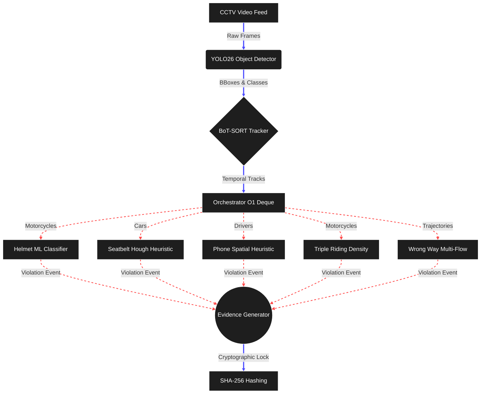

# FLUXO

Automated traffic violation detection on CCTV footage. Built for Gridlock Hackathon 2.0 (Flipkart x Bengaluru Traffic Police).

Bengaluru Traffic Police ran a 2-day manual enforcement drive and booked 573 violations. That is the upper bound of what manual review can do. FLUXO automates this process: detecting vehicles, classifying violations, reading number plates, capturing evidence, and generating downloadable reports.

---

## System Architecture

FLUXO uses a Unified Single-Pass Pipeline. Instead of running 10 different models at once (which slows down the system), it finds all vehicles once, tracks them, and then checks for different violations at the same time.



## Production Architecture & Model Refinements

This project implements several architectural optimizations to meet edge-deployment standards:

1. **O(1) Memory Management:** Stateful tracking across continuous video streams requires bounded memory. We transitioned from unbounded arrays to fixed-size `collections.deque` buffers, guaranteeing O(1) time complexity and eliminating Out-of-Memory (OOM) risks during prolonged inference.
2. **Heuristic & ML Hybridization for False Positive Reduction:** 
   - **Helmet Classification:** We trained a dedicated secondary YOLO classifier (`fluxo_helmet_v1.pt`) on an annotated dataset to resolve edge cases where baseline models confuse turbans and caps with helmets.
   - **Seatbelt Geometry:** Instead of standard pixel intensity thresholds, the seatbelt module utilizes Probabilistic Hough Transform (`cv2.HoughLinesP`) to mathematically isolate the diagonal structural gradient of the belt.
   - **Mobile Phone Persistence:** To mitigate false positives from steering wheels, phone detection requires spatio-temporal persistence: the target bounding box must exhibit skin-color adjacency and persist for at least three consecutive frames.
3. **Multi-Modal Flow Clustering:** Traditional wrong-way detection fails on unmarked Indian two-way roads. FLUXO implements circular histogram clustering to dynamically learn up to two primary trajectory vectors, adapting to bidirectional traffic autonomously.
4. **Cryptographic Integrity:** To ensure legal defensibility, all output violation payloads are processed through a deterministic SHA-256 hashing algorithm, preventing post-inference tampering of the evidence frames.

## What it detects

| Violation | How it works |
|-----------|-----|
| No helmet | A trained classifier distinguishes helmets from turbans, caps, and scarves. |
| Triple riding | Uses trapezium shapes instead of standard boxes to handle crowded motorcycle traffic. |
| Red light jump | Detects when a vehicle crosses the stop-line while the signal is red. |
| Junction blocking | Flags vehicles trapped in the intersection during heavy traffic congestion. |
| Wrong-way driving | Tracks vehicle direction against the expected traffic flow. |
| Mobile phone usage | Detects a phone held to the ear while driving. |
| No seat belt | Looks for the diagonal seat belt stripe on car occupants. |
| Overloading | Flags overloaded goods vehicles based on their shape. |
| Fancy/hidden plates | Custom logic to catch modified or hidden number plates. |
| Missing mirrors | Flags two-wheelers without rear-view mirrors. |
| Number plate reading | Uses EasyOCR combined with state-code validation. |

## Research Basis

Every design choice addresses a documented real-world problem:

- **YOLO26 over YOLOv11**: [Eliminates NMS entirely](https://arxiv.org/abs/2601.12882), [43% faster CPU inference](https://www.ultralytics.com/blog/ultralytics-yolo26-the-new-standard-for-edge-first-vision-ai).
- **Trapezium boxes for triple riding**: Rectangular bounding boxes merge in dense traffic. [Goyal et al. (CVPR 2022)](https://arxiv.org/abs/2204.08364), [US Patent 12,315,264](https://patents.google.com/patent/US12315264B2).
- **Headwear classifier**: Generic classifiers confuse turbans with helmets. [Deshpande et al. (Frontiers in AI, 2025)](https://doi.org/10.3389/frai.2025.1582257).
- **EasyOCR over Tesseract**: [ResearchGate comparison (2024)](https://www.researchgate.net/publication/378948224) shows EasyOCR works better for Indian fonts and low-resolution CCTV.
- **Fancy plate detection**: [TR-TRVD paper (2024)](https://doi.org/10.5281/zenodo.13953874) notes this is an unaddressed gap in current systems.
- **Missing mirror detection**: [arXiv:2511.12206 (IEEE, 2025)](https://arxiv.org/abs/2511.12206). Legally enforceable under Indian Motor Vehicle rules.
- **Mobile phone detection**: BTP added this in 2024 ([Hindustan Times, Sep 2024](https://www.hindustantimes.com/cities/bengaluru-news/aipowered-cameras-to-detect-13-types-of-violations-in-bengaluru-traffic-report-101727404715450.html)).
- **Seat belt detection**: Accounts for 16% of BTP's automated detections ([Times of India, Oct 2025](https://timesofindia.indiatimes.com/city/bengaluru/87-of-traffic-violation-detection-on-bengaluru-roads-now-contactless/articleshow/124535743.cms)).
- **Overloading detection**: Transport Dept deploying AI cameras for this ([The Hindu, Jun 2025](https://www.thehindu.com/news/national/karnataka/ai-powered-cameras-to-be-installed-on-karnataka-highways-to-curb-accidents-and-violations/article69745351.ece)).
- **Event-triggered clips**: Saving only the seconds around an infraction reduces storage by 80% ([IJARCCE, Jan 2026](https://ijarcce.com/wp-content/uploads/2026/01/IJARCCE.2026.15133.pdf)).

## Evidence Reports

When FLUXO detects a violation, it captures a secure frame snapshot:
- **Red border** around the violating vehicle with the violation type and plate number.
- **Green border** around all other vehicles to show context.
- The frame number and a unique cryptographic hash are watermarked to prevent tampering.

After processing, you can download a self-contained HTML evidence report with all snapshots and timestamps.

## Quick start

```bash
git clone https://github.com/itzsouravkumar/Fluxo.git
cd Fluxo
pip install -r requirements.txt
streamlit run app.py
```

Open http://localhost:8501.

## License

Hackathon project. Gridlock Hackathon 2.0.

---
*FLUXO - Built for Bengaluru Traffic Police, June 2026*
